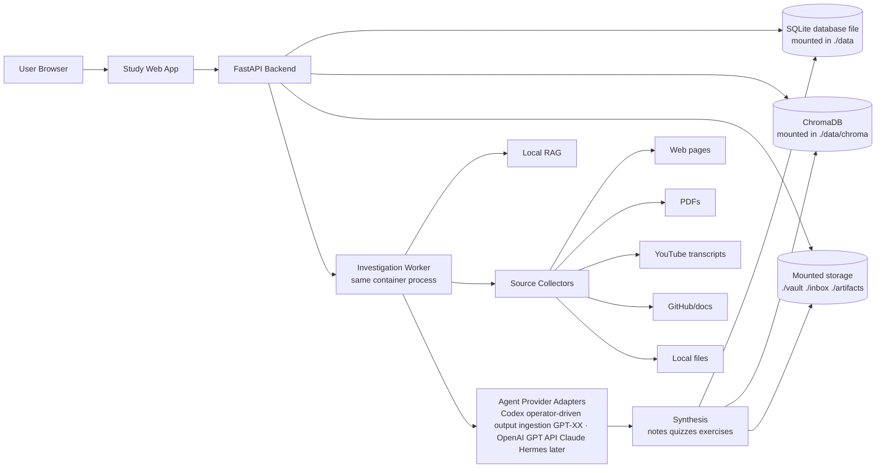

# PRD - NCP-AAI Agentic Study Platform

> A local-first, Dockerized research and study platform for the NVIDIA NCP-AAI certification. The system investigates each exam topic in parts, collects and cites high-quality sources from web pages, PDFs, YouTube transcripts, official documentation, local files, and agent outputs, then turns that material into an interactive study web app with RAG, quizzes, exercises, feedback, and readiness tracking.

**Status:** v2.0 - expanded product direction approved.
**Owner:** Solo candidate.
**Primary UI:** Web app.
**Deployment target:** Single Docker container with bind-mounted persistent data on disk.
**MVP decisions:** Codex as the operator-driven investigation/synthesis provider — the user runs Codex, and the app ingests, validates, indexes, and tracks provenance on Codex's outputs (the app does not invoke Codex headlessly). React/Vite frontend, SQLite database. The models Codex routes to are described in `EXAM_OBJECTIVES.md`.

---

## 1. Executive Summary

### Problem Statement

Preparing for NCP-AAI requires learning a broad, fast-moving body of agentic AI and NVIDIA platform knowledge scattered across official docs, papers, PDFs, videos, GitHub repos, release notes, blogs, and personal notes. Manual research does not scale across every exam topic, and passive notes do not reliably produce exam readiness.

### Proposed Solution

Build a single-user agentic study platform with two main systems:

1. **Investigation Engine:** asynchronously researches one topic or sub-objective at a time, gathers source material from multiple source types, extracts relevant content, cites every claim, stores raw and normalized artifacts, and produces structured study material.
2. **Study Web App:** provides the main student experience for triggering investigations, browsing topic coverage, asking questions, reviewing sources, taking quizzes, receiving exercises, giving feedback, and tracking readiness toward passing the exam.

The app runs inside one Docker container. All user data, source artifacts, vector indexes, generated notes, quiz history, and app state are persisted through mounted host directories so deleting or rebuilding the container does not delete study data.

### Success Criteria

1. **Exam objective coverage:** 100% of objectives in `EXAM_OBJECTIVES.md` have at least one synthesized study note, at least three quiz items, and at least three cited source references.
2. **Research breadth:** each completed objective includes sources from at least two source categories when available, such as official docs, PDFs, videos, GitHub, or articles.
3. **Citation grounding (MVP):** every citation in a study note or quiz item points to a real, stored `source_chunk`, and each generated claim links to the specific chunk it was drawn from so it can be inspected. *(Stretch: verify each claim is semantically supported by its cited span via an LLM-judge / NLI pass — citation existence alone does not prove support.)*
4. **Question bank (stretch goal):** at least 300 exam-style questions with answer, rationale, difficulty, topic mapping, and citation. "Validated" requires a defined authority — until one exists, treat AI-generated questions as draft material to be spot-checked against official sources, not as a verified bank.
5. **Readiness gate:** user reaches at least 85% average score across the last five quizzes for every weighted domain. *(Depends on domain weights; resolve the 92%-sum discrepancy in `EXAM_OBJECTIVES.md` before computing readiness — see Open Questions.)*
6. **RAG quality (stretch goal):** retrieval reaches at least 85% Precision@5 on a 50-query hand-authored benchmark. Building and labeling this benchmark is real effort and is not part of the MVP task list; schedule it explicitly if adopted as a gate.
7. **Persistence guarantee:** deleting and recreating the Docker container keeps all study data intact when host data mounts are preserved.
8. **Incremental investigation:** a topic can be resumed across multiple jobs without duplicate sources or lost work.

### Primary Milestone — Time-to-First-Study-Value

The exam is on **2026-11-04**; the real goal is passing it, not finishing the platform. Before
any of the feature-completeness criteria above, the project must hit one early milestone:

> Ingest the bundled NVIDIA study-guide PDF → chunk → embed → ask a grounded question → receive
> an answer with a working citation, and produce one synthesized note + quiz for one objective.

This vertical slice can ship through a CLI or a single endpoint, days into the build, before the
multi-view web app. It de-risks the synthesis engine (provider + grounding) while it is still
cheap to change, and it is the point at which the system starts saving study time.

---

## 2. User Experience & Functionality

### User Personas

- **The Candidate:** a technical certification candidate who wants comprehensive research, active recall, source-backed explanations, and measurable readiness.
- **The Investigation Agent Operator:** the same user when supervising agents, reviewing source quality, retrying failed jobs, and approving generated study material.

### Core Product Areas

#### A. Investigation Engine

The investigation engine researches topics in parts. It does not need to collect every possible source in one run. It must support resumable jobs, topic coverage state, source deduplication, and agent-provider adapters.

Supported source categories:

- Official NVIDIA documentation, courses, blogs, whitepapers, release notes, and GitHub repositories.
- Certification PDFs and downloaded local PDFs.
- YouTube videos through metadata and transcripts when available.
- Web articles, standards, papers, and technical documentation.
- Local Markdown, text, HTML, and existing Obsidian notes.
- Student-provided documents, papers, URLs, pasted notes, and raw information attached to specific topics.
- Outputs produced by Codex (operator-driven) or future investigation agents, ingested with full provenance.

#### B. Study Web App

The web app replaces Lavish as the primary study interface. Lavish remains optional for rich generated artifacts, but the main daily workflow happens in the app.

Primary screens:

- **Dashboard:** domain readiness, objective coverage, recent activity, weak areas, and active investigations.
- **Objectives:** browse the exam objective tree from `EXAM_OBJECTIVES.md`.
- **Topic Detail:** view investigation status, source list, synthesized notes, diagrams, questions, exercises, and unresolved gaps.
- **Add Material:** upload or paste documents, papers, notes, links, and raw information into a topic's investigation material.
- **Investigation Console:** trigger, pause, resume, retry, or inspect research jobs.
- **Study Chat:** ask grounded questions using RAG over collected material.
- **Quiz & Exercises:** take exam-style questions, receive explanations, and get targeted drills.
- **Sources:** inspect PDFs, web pages, video transcripts, metadata, extracted text, and citations.
- **Settings:** configure model providers, API keys, source limits, data paths, and Docker persistence paths.

### User Stories & Acceptance Criteria

**US-1 - Trigger an investigation**

As a candidate, I want to start an investigation for one objective or topic so that the system gathers relevant source material and creates a study unit.

- **AC-1.1:** The app supports starting an investigation from an objective, topic page, or free-text prompt.
- **AC-1.2:** The investigation is stored as a resumable job with status: `queued`, `collecting_sources`, `extracting`, `synthesizing`, `needs_review`, `complete`, or `failed`.
- **AC-1.3:** The job queries the local knowledge base before external search.
- **AC-1.4:** The job collects sources from configurable source categories and records source metadata.
- **AC-1.5:** The job can stop after a bounded batch and resume later without duplicating unchanged sources.

**US-2 - Collect comprehensive source material in parts**

As a candidate, I want the system to explore official docs, PDFs, YouTube videos, GitHub repos, and web sources over multiple passes so that each topic becomes deeply researched.

- **AC-2.1:** Each source has a stable ID, URL or file path, content type, retrieval timestamp, hash, title, and topic mapping.
- **AC-2.2:** PDFs are parsed into page-aware Markdown or text with page citations.
- **AC-2.3:** YouTube videos are represented by metadata and transcript text when transcripts are available.
- **AC-2.4:** Web pages are converted to normalized Markdown or text with URL provenance.
- **AC-2.5:** Source extraction failures are stored with error details and retry status.
- **AC-2.6:** Investigation jobs record unexplored leads for later passes.

**US-3 - Generate study material**

As a candidate, I want each investigated topic converted into notes, diagrams, summaries, quizzes, and exercises so that I can study efficiently.

- **AC-3.1:** Each completed topic has a synthesized study note with concepts, NVIDIA context, implementation details, diagrams, key terms, and references.
- **AC-3.2:** The system generates at least five quiz questions per topic by default.
- **AC-3.3:** Every quiz question includes one correct answer, distractors, rationale, difficulty, objective mapping, and citations.
- **AC-3.4:** Generated material marks uncertain claims for review instead of presenting them as fact.
- **AC-3.5:** User feedback can trigger a regeneration or targeted follow-up investigation.

**US-4 - Study through the web app**

As a candidate, I want a browser-based app that guides my study workflow so that I can learn, practice, and measure readiness in one place.

- **AC-4.1:** The dashboard displays coverage and readiness by exam domain and sub-objective.
- **AC-4.2:** The topic detail page shows notes, citations, source list, quizzes, exercises, and job history.
- **AC-4.3:** The chat answers questions using RAG and shows citations from stored sources. *(MVP/early chat is retrieval-first — it returns the most relevant cited passages, since there is no embedded LLM; generative natural-language answers depend on operator-driven Codex or a later programmatic provider. This is a v1.2 capability.)*
- **AC-4.4:** Quiz attempts are saved with score, timestamp, topic, domain, and missed concepts.
- **AC-4.5:** The app recommends exercises based on weak topics and recent quiz failures.

**US-5 - Persist data outside Docker**

As a candidate, I want all study data to remain on disk even if I delete or recreate the container.

- **AC-5.1:** The Docker container uses bind mounts for all persistent paths.
- **AC-5.2:** Required host-mounted directories include `./data`, `./vault`, `./inbox`, and `./artifacts`.
- **AC-5.3:** Application state, source registry, vector database, generated notes, artifacts, and quiz history are written only to mounted persistent paths.
- **AC-5.4:** A documented restore test deletes and recreates the container, then verifies that topics, sources, embeddings, notes, and quiz history remain available.

**US-6 - Add student-provided material**

As a candidate, I want to add documents, papers, links, notes, and raw information to a topic so that my own material becomes part of the investigated corpus and knowledge base.

- **AC-6.1:** The topic detail page supports adding material by file upload, local inbox selection, URL, or pasted raw text.
- **AC-6.2:** Supported MVP file types include `.pdf`, `.md`, `.txt`, and `.html`.
- **AC-6.3:** Added material is attached to one or more topics or objectives before ingestion.
- **AC-6.4:** The system creates a `SourceRecord` for the material with provenance, content hash, source type, ingest timestamp, and user-supplied notes.
- **AC-6.5:** The material is normalized, chunked, embedded, and added to ChromaDB so future RAG answers and investigations can retrieve it.
- **AC-6.6:** Added material appears in the topic source list and can be cited by generated notes, answers, quizzes, and exercises.
- **AC-6.7:** Re-adding unchanged material does not duplicate source records, chunks, or vectors.

**US-7 - Use multiple investigation agents**

As an operator, I want the platform to support multiple investigation agents — Codex first (operator-driven, using its integrated GPT models), and later programmatic providers (e.g. the OpenAI GPT API, Claude, Hermes) — so that I can route research to the best available tool.

- **AC-7.1:** The backend defines a provider adapter interface for investigation/synthesis agents, including an output-ingestion path for operator-driven agents like Codex.
- **AC-7.2:** The MVP implements the Codex output-ingestion path, but the interface must support adding programmatic providers without changing topic, source, or job schemas.
- **AC-7.3:** Each generated artifact records the provider, model, prompt template version, timestamp, and source inputs.

### Non-Goals for MVP

- Multi-user SaaS.
- Mobile app.
- Model fine-tuning.
- Full proctored exam simulator.
- Browser automation that bypasses paywalls or terms of service.
- Downloading copyrighted videos or restricted PDFs without user-provided access.
- Kubernetes deployment.
- Multiple Docker services in MVP.

---

## 3. AI System Requirements

### Tool Requirements

- `query_knowledge_base(query, filters, k)` - retrieve source-backed chunks from ChromaDB.
- `ingest_document(path, source_type, metadata)` - parse local files into normalized text and chunks.
- `add_user_material(topic_id, material)` - attach user-provided files, URLs, or raw text to a topic and ingest them into the knowledge base.
- `search_web(query, source_policy)` - collect candidate web results.
- `fetch_web_page(url)` - fetch and normalize public pages.
- `fetch_pdf(url_or_path)` - ingest PDFs from URL or local path.
- `fetch_youtube_transcript(video_url)` - store video metadata and transcript when available.
- `search_github(query)` - collect repository, file, issue, or documentation leads when relevant.
- `run_investigation(topic_id, batch_limits)` - execute a bounded investigation pass.
- `synthesize_topic(topic_id)` - generate notes, references, quizzes, exercises, and unresolved gaps.
- `grade_quiz_attempt(attempt_id)` - score and store user performance.
- `record_feedback(topic_id, feedback)` - attach feedback and optionally create follow-up jobs.

### Agent Provider Requirements

The MVP uses **Codex as the operator-driven investigation/synthesis provider**. The operator runs
Codex (CLI/IDE) to research a topic and produce structured study material — notes, citations,
quiz items, and identified gaps. The app does **not** invoke Codex headlessly inside the
container; instead it provides an **agent-output ingestion path** that accepts Codex's structured
output, validates it (every citation must resolve to a stored source chunk), indexes it for RAG,
and records full provenance. This deliberately avoids the cost and fragility of non-interactive
Codex invocation in Docker, and matches the existing "Outputs produced by Codex" source category.
Synthesis runs on Codex's integrated GPT models (GPT-XX); no separate model keys are configured
(see `EXAM_OBJECTIVES.md`).

The platform must not hard-code Codex as the permanent engine; the same adapter boundary supports
adding programmatic providers later:

- Codex (operator-driven, output ingestion, integrated GPT models) — the MVP path.
- The OpenAI GPT API for in-app generation when programmatic synthesis is added later.
- Claude or other hosted APIs for deep synthesis when configured.
- Hermes for persistent learning memory if configured.

Each provider adapter must expose:

- capabilities,
- model identifier,
- max context,
- tool access policy,
- cost or rate-limit metadata when known,
- structured output support,
- execution logs,
- error and retry behavior.

### Evaluation Strategy

- **Source quality:** completed topics must include source diversity, source recency where relevant, and official-source preference for NVIDIA-specific facts.
- **Groundedness:** generated notes and answers must cite stored sources. Unsupported claims are flagged.
- **Quiz quality:** sampled audits must reach at least 95% answer-key correctness.
- **RAG quality:** evaluate Precision@5 on at least 50 hand-authored queries.
- **Coverage:** every objective in `EXAM_OBJECTIVES.md` maps to topic records, source records, notes, and quiz items.
- **Persistence:** container recreation test must confirm all persistent state survives.

---

## 4. Technical Specifications

### Architecture Overview

### Single-Container Deployment

The MVP uses a single Docker image and one container for the web app, API, background worker, local source processing, and RAG services.

Required host mounts:

| Host path | Container path | Purpose |
|---|---|---|
| `./data` | `/app/data` | App database, ChromaDB, job state, settings, logs |
| `./vault` | `/app/vault` | Generated study notes and optional Obsidian-compatible Markdown |
| `./inbox` | `/app/inbox` | User-dropped PDFs, Markdown, HTML, text, and other inputs |
| `./artifacts` | `/app/artifacts` | Generated HTML, diagrams, exports, reports |

Deleting the container must not delete any files in these host directories.

### Recommended Initial Stack

| Component | Choice | Reason |
|---|---|---|
| Backend | FastAPI | Good fit for API, workers, Python RAG, and future agent tools |
| Frontend | React/Vite built into the same container | Rich study interactions while preserving single-container deployment |
| Database | SQLite for MVP, with schema compatible with later Postgres migration | Simple single-user persistence on disk |
| Vector store | ChromaDB persistent client | Local RAG and simple persistence |
| Embeddings | `sentence-transformers/all-MiniLM-L6-v2` | Local, deterministic, inexpensive |
| PDF parsing | PyMuPDF first, optional OCR later | Reliable local PDF extraction |
| YouTube transcripts | transcript API when available | Avoid video downloads and preserve text provenance |
| Background jobs | In-process queue on a worker thread (not the request path); SQLite in WAL mode | Synthesis/embedding jobs run for minutes — keep them off the Uvicorn event loop while avoiding multi-service complexity |
| Docker | One image, bind-mounted data | Matches user requirement |

### Data Model

Minimum persistent entities:

- `domains`
- `objectives`
- `topics`
- `investigation_jobs`
- `source_records`
- `source_chunks`
- `topic_sources`
- `notes`
- `citations`
- `quiz_questions`
- `quiz_attempts`
- `exercise_recommendations`
- `agent_runs`
- `feedback_items`

### Security & Privacy

- API keys are loaded from `.env` or mounted secrets and are never committed.
- Source collection must respect robots, access limits, copyright, and user-provided credentials.
- Cloud agent providers may receive prompts, extracted source text, and generated notes. The UI must make this clear.
- All persistent local study data lives in mounted host directories.
- Destructive actions on stored notes, sources, or quiz history require explicit confirmation in the app.

---

## 5. Risks & Roadmap

### Phased Rollout

**MVP - Local Docker Study Platform**

- Single Docker container.
- Bind-mounted persistent data.
- FastAPI backend.
- Basic web dashboard.
- Objective browser from `EXAM_OBJECTIVES.md`.
- Local file ingestion for Markdown, text, HTML, and PDFs.
- ChromaDB RAG.
- Manual topic investigation trigger.
- Codex operator-driven output ingestion as the synthesis path.
- Notes, citations, and quiz generation.

**v1.1 - Research Breadth**

- Web search and web page extraction.
- YouTube metadata and transcript extraction.
- GitHub/doc source collection.
- Source deduplication and resumable investigation passes.
- Topic gap tracking.

**v1.2 - Study Loop**

- Study chat with citations.
- Quiz attempts and readiness dashboard.
- Weak-topic exercise recommendations.
- User feedback-driven follow-up jobs.

**v2.0 - Multi-Agent Research**

- Programmatic provider adapters (OpenAI GPT API, Claude, Hermes) for in-app generation beyond the MVP Codex output-ingestion baseline.
- Routing by task type and source size.
- Agent run comparison and quality scoring.
- Optional Lavish artifact export from topic pages.

### Technical Risks

| Risk | Likelihood | Impact | Mitigation |
|---|---:|---:|---|
| Source collection becomes too broad or slow | High | High | Use bounded investigation batches, resumable jobs, source limits, and unexplored lead queues |
| Generated material contains unsupported claims | Medium | High | Require citations, groundedness checks, and review flags |
| YouTube transcripts unavailable or low quality | Medium | Medium | Store metadata, mark transcript unavailable, allow manual transcript upload |
| PDF extraction loses tables or figures | Medium | Medium | Store page references, preserve raw file, add manual review flags |
| Single container becomes complex | Medium | Medium | Keep clear module boundaries so services can split later if needed |
| Data loss through Docker misuse | Low | High | Bind mounts, documented restore test, startup warning when persistent paths are not mounted |
| Agent provider APIs change or rate-limit | Medium | Medium | Adapter layer, retries, local fallback, provider capability metadata |

### Decisions

1. **Initial investigation/synthesis provider:** Codex, operator-driven — the user runs Codex (using its integrated GPT models, GPT-XX) and the app ingests/validates/indexes its outputs (no headless invocation, no separate model keys). Programmatic providers are a later adapter.
2. **MVP frontend:** React/Vite.
3. **MVP database:** SQLite stored under the mounted `/app/data` directory.
4. **Persistence model:** host bind mounts remain mandatory for `./data`, `./vault`, `./inbox`, and `./artifacts`.

### Open Questions

1. What host path should be the default persistent study directory outside the repo?
2. **Domain weights sum to 92%, not 100%** (`EXAM_OBJECTIVES.md` flags this). Verify the weights
   against the official NVIDIA source and close the 8% gap before implementing the readiness math
   (SC-5), since the dashboard scores are weight-dependent.
3. What is the authority for "validated" quiz questions (SC-4)? Without one, the question bank is
   draft material, not a verified bank.

---

## Related Sources

- `EXAM_OBJECTIVES.md` - objective tracker and domain source of truth.
- `SPECS.md` - original Obsidian, RAG, Hermes, OpenCode, and Lavish concept.
- `README.md` - currently minimal and should be updated once implementation begins.
