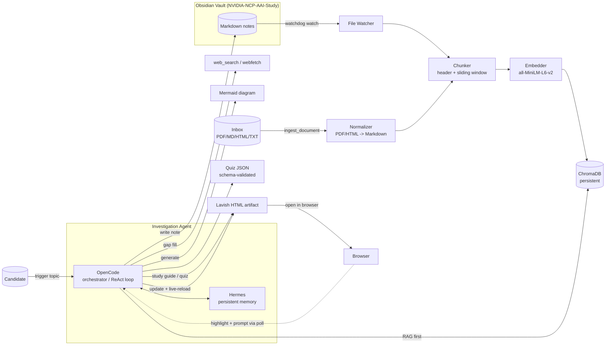

# PRD — NCP-AAI Personal Agentic Study Engine

> A self-improving, local-first study environment for the **NVIDIA NCP-AAI (Agentic AI Professional)** certification. Combines an Obsidian knowledge vault, local RAG (ChromaDB), an autonomous investigation agent (OpenCode orchestrator + Hermes persistent memory), and an interactive Lavish study/review loop.

**Status:** v1.0 — discovery complete; ready to build. (MiniMax setup deferred — owner-owned.)
**Owner:** Solo candidate (cloud-first, single-user).

---

## 1. Executive Summary

**Problem Statement.**
Preparing for NCP-AAI means absorbing a large, fast-moving body of NVIDIA-specific platform knowledge (NeMo, NIM, Guardrails, multi-agent orchestration, evaluation) that is scattered across docs, papers, and release notes. Passive reading + manual note-taking doesn't produce reliable recall or measurable readiness, and it leaves no reusable, queryable asset.

**Proposed Solution.**
A personal agentic study engine where the candidate triggers a topic (e.g., *"Implement reasoning and action frameworks"*), and an autonomous agent (1) checks the local knowledge base first (RAG over Obsidian), (2) investigates gaps via web search, (3) writes a structured Obsidian note (concepts + NVIDIA context + Mermaid diagram + citations), (4) generates exam-style quizzes, and (5) presents an interactive, annotatable study guide in Lavish whose feedback loop refines the material live.

**Success Criteria (KPIs).**
1. **Pass NCP-AAI on first attempt** (binary, ultimate outcome).
2. **≥ 100% official-objective coverage**: every exam objective has ≥ 1 Obsidian study note **and** ≥ 3 vetted quiz items.
3. **Question bank ≥ 300** items, each with a verified-correct keyed answer + source citation.
4. **Quiz readiness gate**: ≥ 85% mean score across the last 5 self-graded quizzes per domain.
5. **RAG retrieval quality**: ≥ 85% Precision@5 on a held-out set of 50 topic queries.
6. **Time-to-note < 5 min** from investigation trigger to a saved, structured Obsidian note.
7. **Quiz answer-key accuracy ≥ 95%** (unambiguously correct, citation-backed).
8. **Ingestion throughput: 100-page PDF → wiki + RAG in < 60 s** (excluding optional OCR).

---

## 2. User Experience & Functionality

### User Personas
- **The Candidate (primary).** A technical cert aspirant who wants depth, NVIDIA-specific context, active recall practice, and a permanent searchable second brain — not another set of generic AI flashcards.

### User Stories & Acceptance Criteria

**US-1 — Trigger an investigation**
> *As a candidate, I want to say "Investigate reasoning and action frameworks" and get a complete, sourced study unit, so that I don't manually hunt across docs.*
- **AC-1.1** Agent runs `query_knowledge_base(topic)` before any web call; reuses/synthesizes existing notes when coverage ≥ threshold.
- **AC-1.2** If gaps exist, agent performs targeted web search (≥ 3 distinct sources) and fetches content.
- **AC-1.3** Output is one Obsidian note with sections: **Core Concepts**, **NVIDIA Context**, **Mermaid diagram**, **Key terms**, **References** (with URLs).
- **AC-1.4** Note saved to vault within **< 5 min** of trigger.
- **AC-1.5** A structured quiz (≥ 5 items) is attached or linked.

**US-2 — Review interactively in Lavish**
> *As a candidate, I want the study guide in my browser so I can highlight a part and ask a follow-up that updates the page live.*
- **AC-2.1** Agent emits a self-contained `index.html` (Tailwind/DaisyUI + Mermaid CDN) and opens it via `npx lavish-axi`.
- **AC-2.2** Candidate can highlight text/elements and submit a prompt; agent receives the precise context via `lavish-axi poll`.
- **AC-2.3** Agent applies feedback, rewrites the file, and Lavish **live-reloads** without losing scroll place.
- **AC-2.4** Every factual claim in the artifact is cite-able to a source URL or vault note.

**US-3 — Generate and take a quiz**
> *As a candidate, I want exam-style questions on a topic with immediate feedback so I can practice active recall.*
- **AC-3.1** Quiz is multiple-choice (4 options) unless requested otherwise, with exactly one unambiguously correct answer.
- **AC-3.2** Each item carries a **rationale** and a **source citation**.
- **AC-3.3** Interactive quiz runs in-browser (Lavish) with per-question correctness feedback + running score.
- **AC-3.4** Answer-key accuracy ≥ 95% on a sampled audit.

**US-4 — Query my own knowledge base**
> *As a candidate, I want to ask "what do I already know about Guardrails?" and get grounded answers from my notes.*
- **AC-4.1** RAG retrieves top-k chunks from ChromaDB with source note + heading links.
- **AC-4.2** Retrieval Precision@5 ≥ 85% on held-out queries.

**US-5 — See coverage & readiness**
> *As a candidate, I want a dashboard of which exam objectives I've covered and my quiz readiness.*
- **AC-5.1** Dashboard maps objectives → {has note, has ≥3 quiz items, last quiz score}.
- **AC-5.2** Flags objectives below readiness gate.

**US-6 — Ingest raw documents**
> *As a candidate, I want to drop in a PDF or markdown file (a paper, a docs export, my own notes) so it gets parsed, chunked, and added to my wiki + RAG.*
- **AC-6.1** Accepts `.pdf` and `.md` (also `.txt`, `.html`) via a watched `inbox/` folder **or** an `ingest_document(path)` call.
- **AC-6.2** PDFs are converted to clean Markdown (layout/tables preserved where possible) using a local parser; scanned/image PDFs optionally OCR'd.
- **AC-6.3** Source provenance recorded (original filename, page numbers, ingest timestamp) in front-matter + chunk metadata.
- **AC-6.4** Chunks are embedded into ChromaDB **and** a readable Markdown copy is filed in the Obsidian vault.
- **AC-6.5** Idempotent: re-ingesting an unchanged file (content-hash dedup) creates no duplicate chunks.
- **AC-6.6** A 100-page PDF ingests in **< 60 s** (excluding optional OCR).

### Non-Goals (v1)
- **Not** training or fine-tuning models.
- **Not** a mobile app.
- **Not** a multi-user/cloud SaaS — strictly single-user, local-first.
- **Not** a replacement for official NVIDIA courseware — a complement/accelerator.
- **Not** automated study-calendar scheduling (deferred to v2).
- **Not** proctoring or real exam simulation UI beyond practice quizzes.

---

## 3. AI System Requirements

### Model Stack (cloud-first, local fallback) — strength-routed

Cloud models are primary (best quality, no VRAM limits); local models serve as offline fallback. Routing by model strength:

| Task | Primary (cloud) | Why this model | Fallback (local) |
|------|-----------------|----------------|------------------|
| Investigation / multi-source synthesis / quiz generation / evaluation | `deepseek/deepseek-v4-pro` | Top-tier reasoning rigor | `qwen2.5-coder:7b-32k` |
| Structured note authoring · Mermaid diagrams · JSON/tool calls · code scaffolding | `zai/glm-5.1` | Strong structured output + code | `gemma4:e4b-64k` |
| Fast ops: routing, classification, streaming chat, simple lookups | `deepseek/deepseek-v4-flash` / `zai/glm-5-turbo` | Speed + cost | `qwen2.5-coder:7b-32k` |
| Long-context doc ingestion (100+ page PDFs) | `deepseek/deepseek-v4-pro` *(MiniMax pending)* | Long context | — |
| Embeddings (RAG) | **all-MiniLM-L6-v2** (384-d) · `sentence-transformers` | Cheap, local, deterministic | — |

**Configured providers** (per `~/.config/opencode/opencode.json`): `deepseek` (v4-pro, v4-flash), `zai` (glm-5, glm-5.1, glm-5-turbo), `openrouter` (qwen3.6-plus), `ollama` (qwen2.5-coder:7b-32k, gemma4:e4b-64k) for fallback.
**MiniMax — deferred (owner-owned).** Ideal role: long-context (1M) ingestion + multimodal. Owner will configure the provider later (direct or via OpenRouter). Non-blocking for MVP; long-context ingestion uses `deepseek-v4-pro` until MiniMax is wired.

> Local fallback note: configured local models are 7B-class. For higher-quality offline fallback on the 16 GB GPU, optionally pull `qwen2.5:14b-instruct` — recommended for resilience.

### Tool Requirements (agent function-calling surface)
- `query_knowledge_base(topic, k=5)` — RAG over ChromaDB.
- `ingest_document(path)` — parse PDF/MD/HTML/TXT → Markdown → chunk → embed → ChromaDB **and** file a readable copy in the vault; idempotent via content-hash dedup.
- `web_search(query)` — Tavily **or** DuckDuckGo (provider + key **TBD**).
- `webfetch(url)` — fetch + markdown-convert.
- `write_note(path, content)` / `update_note` — filesystem to Obsidian vault.
- `render_mermaid(spec)` — validate syntax before emit (lint).
- `lavish_present(html_path)` / `lavish_poll` / `lavish_reply` — Lavish loop via `npx -y lavish-axi`.
- `generate_quiz(topic, n, schema)` — returns JSON validated against a quiz schema.

### Agent Roles
- **OpenCode — Orchestrator & primary investigator.** Owns the investigation loop (ReAct-style): observe query → RAG check → decide search → synthesize → write note → present in Lavish. Has native web/bash/fs access; lowest setup cost.
- **Hermes — Persistent learning memory.** Long-term memory across sessions; accumulates NVIDIA-domain context (e.g., remembers "Guardrails" when later asked "Guardrails + NIM"). Provides the *self-improving* recall layer.

### Evaluation Strategy
- **Retrieval eval:** held-out 50-query set; measure Precision@5 / Recall@5; regenerate when embeddings change.
- **Quiz quality:** (a) every item passes JSON schema, (b) ≥ 95% answer-key correctness on a sampled audit, (c) citation present.
- **Study-note completeness rubric** (LLM-judge, 0–4 each): definition, NVIDIA context, diagram correctness, quiz presence, citation grounding.
- **Groundedness/anti-hallucination:** every non-trivial claim maps to a source URL or vault note ID; ungrounded claims flagged.
- **Coverage:** objectives × {note?, ≥3 quiz?, last score}.

---

## 4. Technical Specifications

### Architecture Overview

**Data flow:** Two ingest paths feed the vector store — **(a)** live Obsidian edits via the file watcher, and **(b)** raw documents dropped in `inbox/` (PDF/MD/HTML/TXT) normalized to Markdown via `ingest_document`. Both → chunk → embed → ChromaDB. Trigger → agent RAG-checks ChromaDB → (gaps) web search/fetch → synthesizes → writes Obsidian note + Mermaid + quiz → presents Lavish artifact → candidate annotates → agent refines → live reload.

### Integration Points
| Point | Detail |
|-------|--------|
| LLM (cloud, primary) | DeepSeek API (`api.deepseek.com`: v4-pro, v4-flash), ZAI (GLM-5/5.1/5-turbo), OpenRouter (qwen3.6-plus) — via opencode config. |
| LLM (local, fallback) | Ollama `http://localhost:11434` (qwen2.5-coder:7b-32k, gemma4:e4b-64k). |
| Obsidian vault | Local dir `NVIDIA-NCP-AAI-Study/`; watched with `watchdog`. |
| Inbox (raw docs) | `NVIDIA-NCP-AAI-Study/inbox/` for PDF/MD/HTML/TXT; `ingest_document(path)` normalizes → Markdown → vault + ChromaDB. PDF parsing via `pymupdf` (MarkItDown alt); OCR via `tesseract` (optional, scanned PDFs). |
| Vector store | ChromaDB persistent client at `./chroma_db`. |
| Web search | **DuckDuckGo** (free, no API key) — resolved. Results cached in vault. |
| Lavish | `npx -y lavish-axi` (no global install). |

### Security & Privacy
- **Data flow (cloud-first):** investigation prompts, note text, and quiz content are sent to cloud LLM providers (DeepSeek, ZAI, OpenRouter). Embeddings + vector store stay **local** (MiniLM + ChromaDB); vault files stay on-device. Mind each provider's retention policy — avoid putting sensitive personal data in prompts.
- **Secrets:** all API keys in `.env` (gitignored); never hard-coded; never logged.
- **Vault integrity:** agent writes are namespaced to a study folder; destructive ops require confirmation.
- **Provenance:** every generated note records source URLs + model + timestamp in front-matter for auditability.

---

## 5. Risks & Roadmap

### Phased Rollout  *(exam: Nov 4, 2026 · ~4.5 mo runway)*
- **MVP** *(target: ~Jul 6)* — Obsidian vault + `rag_engine.py` (watch → chunk → embed → ChromaDB → `query_knowledge_base`) + `ingest_document` (PDF/MD) + OpenCode investigator (RAG + DuckDuckGo + note + Mermaid) + basic Lavish study guide. Cloud models: deepseek-v4-pro (investigate/quiz), glm-5.1 (notes/Mermaid).
- **v1.1** *(target: ~Aug 17)* — Hermes persistent-memory layer; coverage/readiness dashboard; quiz eval harness + anti-hallucination checks.
- **v2.0** *(target: ~Sep 21; study Sep–Oct)* — Interactive in-Lavish quizzes with grading; spaced-repetition scheduling; multi-agent (Planner/Executor) orchestration. Exam **Nov 4**.

### Technical Risks
| Risk | Likelihood | Impact | Mitigation |
|------|-----------|--------|-----------|
| Cloud LLM hallucinates on niche NVIDIA docs | Med | High | Citation grounding + groundedness eval; route hard topics to deepseek-v4-pro; local fallback if needed. |
| Local fallback quality (7B-class when offline) | Low | Med | Cloud is primary; optionally pull `qwen2.5:14b-instruct` for stronger offline fallback on 16 GB. |
| Quiz answer keys subtly wrong | Med | High | Schema validation + sampled audit ≥ 95% correctness; rationale + source per item. |
| Mermaid syntax errors break render | Med | Low | Lint/validate before emit; fallback render. |
| Web-search rate limits / cost | Med | Med | Provider choice TBD; cache results in vault; budget cap. |
| PDF parsing quality (tables/figures/scans) | Med | Med | Robust local parser (`pymupdf`/MarkItDown); OCR fallback for scans; flag low-confidence pages for review. |
| Official objectives coverage | Low | Low | ✅ All 10 domains in `EXAM_OBJECTIVES.md`. Weights sum to 92% (source) — verify before exam. |

### Open Questions (need your input)
1. ~~Exam objectives~~ — ✅ all 10 domains captured (weights sum to 92% per source doc — flagged for verification).
2. ~~Exam target date~~ — ✅ **November 4, 2026** (~4.5 months runway from Jun 15).
3. ~~Web-search provider~~ — ✅ **DuckDuckGo** (free, no key).
4. ~~Cloud LLM fallback~~ — ✅ **Cloud-first** (DeepSeek + ZAI, strength-routed); local Ollama fallback. MiniMax deferred (owner will configure later).

---

### Exam Domain Coverage *(official — COMPLETE: 10 domains)*
> Full structured tracker with sub-objectives + seed readings: see [`EXAM_OBJECTIVES.md`](./EXAM_OBJECTIVES.md). Raw source ingested at `NVIDIA-NCP-AAI-Study/inbox/nvt-study-guide.md`.
> ⚠️ Official weights sum to **92%** per source doc (15+15+13+5+10+10+7+7+5+5) — flagged for verification.

| # | Domain | Weight | Sub-objs | Note | ≥3 Quiz | Last |
|---|--------|:-----:|:--------:|:----:|:-------:|:----:|
| 1 | Agent Architecture and Design | 15% | 1.1–1.8 | ☐ | ☐ | — |
| 2 | Agent Development | 15% | 2.1–2.6 | ☐ | ☐ | — |
| 3 | Evaluation and Tuning | 13% | 3.1–3.5 | ☐ | ☐ | — |
| 4 | Deployment and Scaling | 5% | 4.1–4.5 | ☐ | ☐ | — |
| 5 | Cognition, Planning, and Memory | 10% | 5.1–5.5 | ☐ | ☐ | — |
| 6 | Knowledge Integration and Data Handling | 10% | 6.1–6.5 | ☐ | ☐ | — |
| 7 | NVIDIA Platform Implementation | 7% | 7.1–7.5 | ☐ | ☐ | — |
| 8 | Run, Monitor, and Maintain | 7% | 8.1–8.5 | ☐ | ☐ | — |
| 9 | Safety, Ethics, and Compliance | 5% | 9.1–9.5 | ☐ | ☐ | — |
| 10 | Human-AI Interaction and Oversight | 5% | 10.1–10.4 | ☐ | ☐ | — |

**Cross-domain NVIDIA stack to emphasize:** NeMo / Agentic NeMo / NeMo Agent Toolkit / NeMo Guardrails / NeMo RL · NIM (microservices + Agent Blueprints) · Triton Inference Server · TensorRT-LLM · Agent Intelligence Toolkit (AIQ Toolkit) · Data Flywheel · Nsight Systems · DGX Cloud · CUDA/GPU ops.
